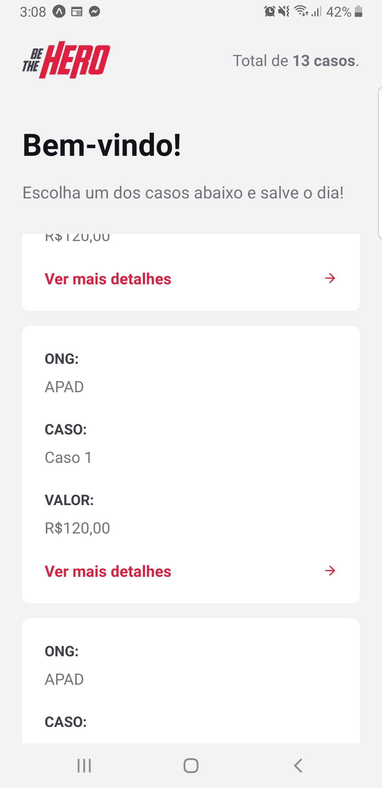
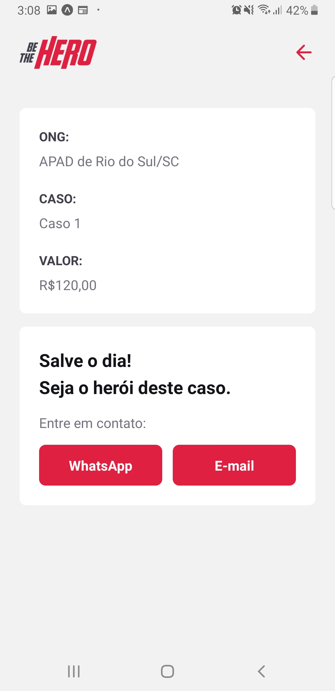

# Semana-Omnistack11

Projeto onde ONGS se cadastram para publicar casos que necessitam de ajuda. 
Assim, usuários podem ver incidentes, tanto na Web quanto no Mobile, que gostariam de ajudar e entrar em contato com a respectiva ONG do caso.

Conhecimentos aplicados:
NodeJS,
ReactJS,
React Native e
Banco de dados SQLite3.

Obs: ao utilizar o QR code com expo, atualizar no arquivo mobile/src/services/api.js o endereço de IP para corresponder ao PC em uso.
